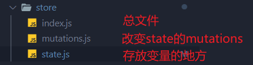

# 记一次实战经历<去哪儿网> vue-cli 2

[项目地址](https://github.com/coder-chin/travel)

## 预备知识

### 1.Git命令：

git add .  放到缓冲区

git commit -m 把缓冲区代码提交到本地仓库中

git push 推到远程仓库

git checkout `branchName` 切换到某分支

git merge origin/index-swiper 将分支合并到主分支

### 2.在style中引入css文件

如果需要**在style中**引入其他的css 文件，则需要使用@import 'path'

如果要用到@(也就是src),则需要在@前面加~,也就是~@

### 3.起别名

在`build/webpack.base.config.js`中resolve的alias修改，**修改以后需要重启服务器**

### 4.开发者工具可以模拟3G网络

network -> no throtting

### 5.宽高比一定

两种办法  1.height:0   padding-bottom: 50%  表示占宽度的50% 标准写法

2.  width:100%  height:50%vw  视口宽度的50%  存在兼容性问题

### 6.使用axios

【补充】：cdn引入axios `<script src="https://cdn.jsdelivr.net/npm/axios@0.12.0/dist/axios.min.js"></script>`

import axios from 'axios'

在声明周期钩子函数中调用函数

```javascript
methods: {
    getCityInfo() {
      axios.get('/api/city.json')
      .then(this.handleGetCityInfoSucc)
    },
    
    handleGetCityInfoSucc (res) {
      res = res.data
      if(res.ret && res.data){
        const data = res.data
        this.cities = data.cities
        this.hotCities = data.hotCities
      }
    }
 }
```

### 7.监听器watch

watch和data、methods、components是并列的，对应的是一个对象类型，对象中是函数，这些函数用于监听数据的改变。函数名就是变量名

```javascript
watch:{
    question([newValue, oldValue]){
        //code
    }
}
```

[vue官网侦听器](https://cn.vuejs.org/v2/guide/computed.html#%E4%BE%A6%E5%90%AC%E5%99%A8)

### 8.indexOf()

string.indexOf(searchvalue[,formindex])该方法用来判断字符串中是否含有特定子字符串。第一个参数是要查找的内容，第二个字符串是要开始查找的索引号，如果没有第二个参数默认从0开始。如果没有找到，返回-1

```javascript
<script type="text/javascript">

var str="Hello world!"
document.write(str.indexOf("Hello") + "<br />")
document.write(str.indexOf("World") + "<br />")
document.write(str.indexOf("world"))

</script>
以上代码的输出：

0
-1
6
```

[js indexOf()用法](https://blog.csdn.net/weixin_41646716/article/details/83270416?ops_request_misc=%257B%2522request%255Fid%2522%253A%2522162221193116780255264690%2522%252C%2522scm%2522%253A%252220140713.130102334.pc%255Fall.%2522%257D&request_id=162221193116780255264690&biz_id=0&utm_medium=distribute.pc_search_result.none-task-blog-2~all~first_rank_v2~rank_v29-1-83270416.first_rank_v2_pc_rank_v29&utm_term=js+indexOf%28%29%E7%94%A8%E6%B3%95&spm=1018.2226.3001.4187)

### 9.vuex

需要进一步学习，了解的比较少

state mutations mapState...

### 10.遍历对象和遍历数组

用v-for遍历数组，第一个参数是元素，第二个参数是索引。

遍历对象中的对象，第一个是对象本身，第二个参数是对象名，用let in 参数是对象名

## 项目预热

安装node.js -> LTS  长期维护版，稳定

github

安装Vue CLI脚手架，创建项目 vue init webpack my-project

## 项目概述

### 项目结构


纠正：static可以存放静态文件，是外界可以直接访问的目录。


重点介绍src目录，我们写的代码都保存在这个目录下assets是一些共用的静态资源，common放的是公共组件，pages放组件，router下面是路由配置文件，store下面是公共数据文件(vuex相关)，App.vue是跟实例，main.js是整个项目的入口。


### 项目初始化

1. 修改meta标签，禁止用户通过手指缩放（不报错表明引用正确）

   `index.html`

```html
<meta name="viewport" content="width=device-width,initial-scale=1.0,minimum-scale=1.0,maximum-scale=1.0,user-scalable=no">
```

2. 引入reset.css(重置样式表)   normalize修改程度比较小   reset.css对默认样式破坏性比较多
   `main.js`

3. 引入border.css   解决在某些手机上border宽度不一的情况
   

4. 解决某些手机存在300毫秒延迟问题

   ```
   npm install fastclick --save  //安装
   import fastClick from 'fastclick' //导入
   fastClick.attach(document.body)  //使用
   ```

5. 删除无用代码，提交本地仓库

## 首页开发

### header区域开发

1.安装stylus（可选）

```
npm install stylus --save
npm install stylus-loader --save
```

2.创建header组件

3.安装less(好用)

```
npm install less less-loader --save-dev
```

修改`build/webpack.base.config.js`

```javascript
{
        test: /\.less$/i,
        loader: [
          // compiles Less to CSS
          "style-loader",
          "css-loader",
          "less-loader",
        ],
      }
```

报错是版本原因，要安装低版本

```
npm uninstall less-loader  //安装less-loader
npm install less-loader@4.1.0  //指定版本
```

### 解决header区域城市自动切换到指定城市



在Home组件中创建一个变量lastCity表示最新当前城市，当路由跳转到当前页面时，让lastCity等于vuex中的city，lastCIty在结构中并没有被用到，他的作用即使监测当前页面被激活时，检查城市是否发生变化，从而决定是否重新发送请求。

在组件Header.vue中我们直接使用vuex中的city。


在computed中

```vue
computed: {
    ...mapState(['city'])
  }
```

就可以直接在当前页面中使用this.city（vuex中的数据）。

当从其他页面跳转到当前页面时，激发activated()钩子函数，检查lastCity是否和vuex中的city一样，如果不一样就改变，并重新发送网络请求。

```javascript
activated() {
    if(this.lastCity !== this.city){
      this.lastCity = this.city
      this.getHomeInfo()
    }
  }
```

```javascript
methods: {
    getHomeInfo() {
      axios.get('./api/index.json')
      .then(this.getHomeInfoSucc)
    },
    getHomeInfoSucc(res) {
      res = res.data
      const data = res.data
      if(res.ret && res.data){
        this.swiperList = data.swiperList
        this.iconList = data.iconList
        this.recommendList = data.recommendList
        this.weekendList = data.weekendList
      }
    }
  }
```

由于本项目只含有北京的数据，我们默认请求数据的时候不传参。

Q:说了这么多？我们在什么时候需要用到上述功能呢？

A:当我们点击城市选择页面城市的时候

` @click='handleCityClick(innerItem.name)`

```javascript
methods: {
    handleCityClick(city){
      this.$store.commit('changeCity',city)
      this.$router.push('/')
    }
  }
```

触发`mutations.js`中的changeCity()函数,city作为第二个参数

`mutations.js`：

localStorage是为了解决关闭页面以后再次打开页面的问题，这样可以直接打开直接的页面。

```javascript
changeCity(state, city) {
    state.city = city;
    try {
      localStorage.city = city;
    } catch (e) {}
  }
```

`state.js`

```javascript
let defaultCity = "北京";
try {
  if (localStorage.city) {
    defaultCity = localStorage.city;
  }
} catch (e) {}

export default {
  city: defaultCity
};
```

### 首页轮播图开发

1. 线上建立分支index-swiper

2. 拉取到本地  git pull

3. 进入分支  git checkout index-swiper

4. 安装swiper 
   `npm install vue-awesome-swiper@2.6.7 --save`
   这里使用v2.6.7老版本，可以在GitHub上找到具体使用的代码
   
   *轮播图的核心结构就是swiper和swiper-slide*
   
   

### 解决图片区域抖动问题

给图片区域高度写死

### vue中css穿透

在使用vue-awesome-swiper时，swiper组件并不属于当前组件，而我们又写了scoped，因此需要用到css穿透。

less和sass无法识别>>>，因此要用到/deep/或者::v-deep  stylus可以识别>>>

```css
<style lang='less' scoped>
  .swiper /deep/ .swiper-pagination-bullet-active 
  //.wrapper >>> .swiper-pagination-bullet-active
  {
    background-color: #fff !important;
  }
</style>
```

从百度到CSDN，最后到Vue.js官网。

[vue官网深度作用选择器](https://vue-loader.vuejs.org/zh/guide/scoped-css.html#%E6%B7%B1%E5%BA%A6%E4%BD%9C%E7%94%A8%E9%80%89%E6%8B%A9%E5%99%A8)   

不得不说，官方文档

### 实现文字省略功能


```javascript
overflow: hidden;
white-space: nowrap;
text-overflow: ellipsis;
```

### 实现图标分页效果

我们可以再次借助轮播图，这次关闭自动播放功能。

因为我们是动态渲染从后端请求过来的数据，因此要实现自动分页，要用到二维数组。

```javascript
computed: {
    pages() {
      const pages = []
      this.list.forEach((item, index) => {
        const page = Math.floor(index / 8)
        if(!pages[page])
          pages[page] = []
        pages[page].push(item)   //二维数组，自动分页
      })
      return pages
    }
  }
```

放到计算属性中，计算属性的成员都是函数(返回一个数据)，但是在使用的时候直接我们当成属性来使用，因此命名一般是名词。

动态渲染

```javascript
<swiper :options="swiperOption">
      <swiper-slide v-for="(page,index) of pages" :key="index">
        <div class="icon" 
        v-for="item of page" :key="item.id">
          
          <p>{{item.desc}}</p>
        </div>
      </swiper-slide>
    </swiper>
```

## 城市页面开发

### 创建分支city-router

在路由文件router/index.js中配置路由

router-link把内容包裹起来，router-link实质就是a标签。  to="path"表示跳转的路径

a标签优先级高，因为浏览器对a标签有默认样式，所以a标签不会继承父类的样式

### 头部开发

```css
position: absolute;
top: 0;
left: 0;
```

### 头部搜索框

input输入框双向绑定keyword来决定是否显示搜索结果，通过搜索结果的长度来决定`没有匹配到数据`是否显示。计算属性:hasNoData

局部导入Bscroll

```
import Bscroll from 'better-scroll'
```

```javascript
mounted() {
   this.scroll = new Bscroll(this.$refs.search)
 }
```

通过ref来绑定DOM

样式

```css
position: absolute;
top: 1.58rem;
left: 0;
right: 0;
bottom: 0;
overflow: hidden;
```

搜索结果的算法(用到了节流)

```javascript
watch: {
    keyword() {
      if(this.timer){
        clearTimeout(this.timer)
      }
      if(!this.keyword){
        this.list = []
        return 
		} //这里解决的是删除搜索框中的内容以后，使搜索结果消失
      this.timer = setTimeout(() => {
        const result = []
        for (let i in this.cities){
			//从A到Z，再逐个遍历
          this.cities[i].forEach( value => {
			//英文名和汉字都检查，只要有一个符合就加入result
            if(value.spell.indexOf(this.keyword) > -1 ||
            value.name.indexOf(this.keyword) > -1){
              result.push(value)
            }
          });
        }
        this.list = result
      },100)
    }
  }
```

### 列表布局

分支city-list

最外层容器的样式：top,left,right,bottom都为0  overflow:hidden

#### better-scroll

```
npm install better-scroll --save
```

按照固定的结构来书写

用ref来获取DOM

`import Bscroll from 'better-scroll'`

`this.scroll = new Bscroll(this.$refs.wrapper)`

页面可以丝滑地滚动

### 页面的动态渲染

分支city-ajax

### 兄弟组件间联动

点击Alphabet组件中的字母，list组件通过事件对象将字母传给父组件city

```javascript
handleLetterClick(e) {
      //e是事件对象
      this.$emit('change',e.target.innerText)
    }
```

city再传给list,LIst组件定位到对应的DOM

利用better-scroll的功能自动滚到某个区域中，通过href获取dom

```javascript
watch: {
    letter() {
      if (this.letter) {
        const element = this.$refs[this.letter][0]   //为什么获取到的是数组?因为ref为该字母的可能有很多
        //如果属性名是一个变量，可以这样写obj[variable]
        this.scroll.scrollToElement(element);
        //定位到该DOM
      }
    },
  }
```

### 实现字母侧边栏连续触摸时滚动到对应区域

给字母绑定触摸事件

```javascript
<ul class="list">
    <li class="item" 
    v-for="item of letters" 
    :key="item"
    :ref="item"
    @touchstart.prevent = 'handleTouchStart'
    @touchmove = 'handleTouchMove'
    @touchend = 'handleTouchEnd'
    @click = handleLetterClick>
      {{item}}
    </li>
  </ul>
```

```javascript
methods: {
    handleLetterClick(e) {
      //e是事件对象
      this.$emit('change',e.target.innerText)
    },
    handleTouchStart(){
      this.touchStatus = true
    },
    handleTouchMove(e){
      if(this.touchStatus){
        if(this.timer){
          clearTimeout(this.timer);
        }
        this.timer = setTimeout(() => {
          console.log(e.touches[0].clientY);
          const touchY = e.touches[0].clientY - 79;    //touch到的字母距离当前盒子顶部的距离
          const index = Math.floor((touchY - this.startY)/20);
          if(index >= 0 && index < this.letters.length){
          this.$emit('change',this.letters[index]);
          }
        },16)
      }
    },
    handleTouchEnd(){
      this.touchStatus = false
    }
  }
```

#### 性能优化

startY放到updated()钩子函数中

当页面数据更新完成

#### 节流

添加定时器

## 详情页面开发

### 实现点击banner画廊出现，点击画廊banner出现

画廊作为banner的一个组件，点击banner时showGalleay变为true,点击画廊时触发自定义事件改变showGallary的值。

### 为banner添加底部阴影

渐变

```
background-image: linear-gradient(top,rgba(0,0,0,0),rgba(0,0.0,.8));
```

### Header渐变

通过动态绑定style实现渐变

```javascript
<div 
    class="header-fixed" 
    v-show="!showAbs"
    :style="opacityStyle">
      <router-link to="/">
        <i class='iconfont header-fixed-back'>&#xe624;</i>
      </router-link>
      景点详情
    </div>
  </div>
```

```javascript
methods: {
    handleScroll() {
      const top = document.documentElement.scrollTop
      if(top > 60){
        let opacity = top / 140
        opacity = opacity > 1 ? 1 : opacity
        this.opacityStyle = {
          opacity
        }
        this.showAbs = false
      }
      else this.showAbs = true
    }
  },
  // activated() {
  //   window.addEventListener('scroll',this.handleScroll)
  // },
  // deactivated() {
  //   window.removeEventListener('scroll',this.handleScroll)
  // }
  mounted () {
    window.addEventListener('scroll', this.handleScroll)
  },
  unmounted () {
    window.removeEventListener('scroll', this.handleScroll)
  }
}
```

开启全局监听以后，同时要开启unmounted，否则会在其他页面一直保持监听。

### 疑点：为什么activated不行

#### 

> 结语：这个项目是我完整做的第一个Vue项目，做下来真的收获很大，对一个完整的项目有了大概的了解。
>
> 项目使用vue + vue-router + vuex全家桶，涉及到逻辑方面的内容也有很多。包括但不限于使用vue，还有vue-cli，Git，其他插件的使用，接触到以前听说过但是不知道是什么的名词（例如节流和防抖），在遇到不懂的地方的时候通过各个社区寻求答案，学会使用专业文档（利于vue官网）。
>
> 感谢老师